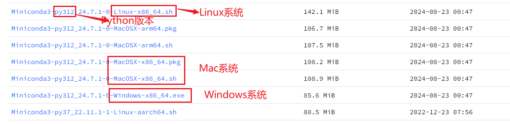
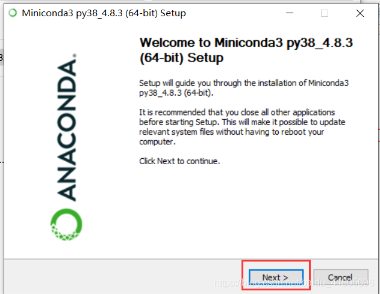
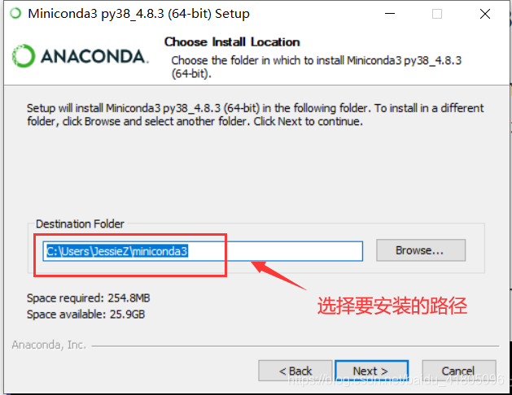
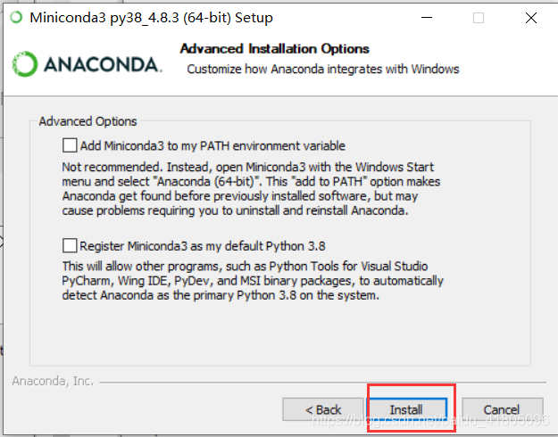
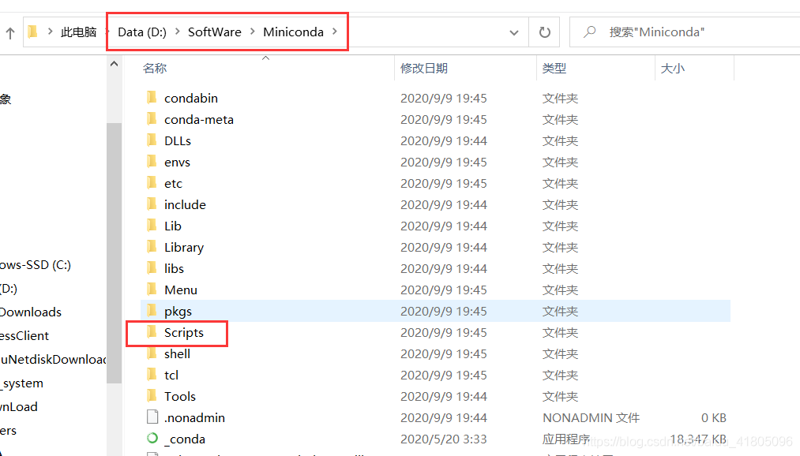
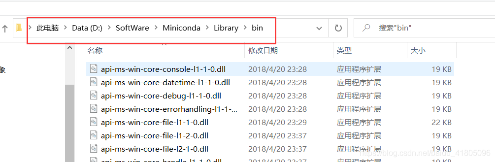
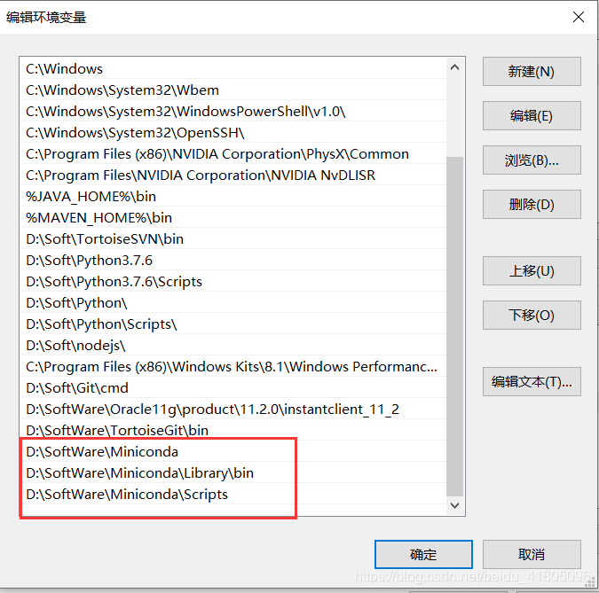
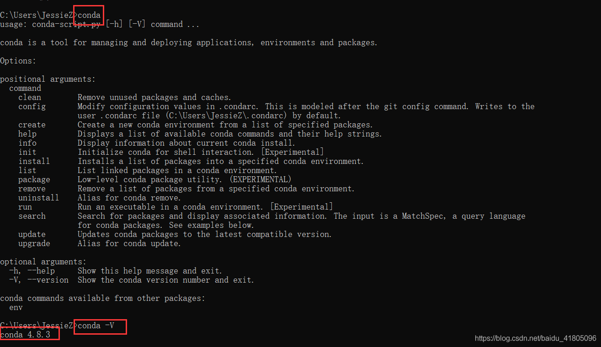
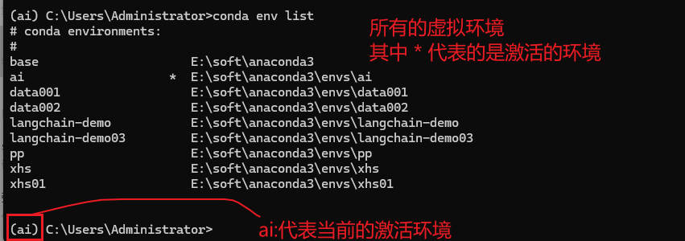

# 下载Anaconda

下载地址: https://mirrors.tuna.tsinghua.edu.cn/anaconda/miniconda/

> 

# 软件安装

`建议不要放到中文目录和空格目录`

在安装过程中, 一路点击next进行安装

> 
>
> 
>
> 
>
> 添加环境变量, 将以下的路径添加到环境变量中
>
> 
>
> 
>
> 

> 验证安装是否成功
>
> 

# 软件的基本使用

```properties
# 1 创建一个虚拟环境
# -n 选项: 指定一个虚拟环境名称, python==3.10.6 指定python的版本信息
conda create -n test01 python==3.10.6

# 2 查看所有的虚拟环境
conda env list  

# 3 激活(启用)虚拟环境  启用虚拟环境 test01
conda activate test01
```

> 

```properties
# 4 安装软件 不写版本号, 默认安装的是最新版本
pip install numpy 
# 指定从清华大学地址下载
pip install pandas -i https://pypi.tuna.tsinghua.edu.cn/simple
# 指定版本安装
pip install numpy == 1.26.4
# 查看所有安装的软件列表
pip list 
```

