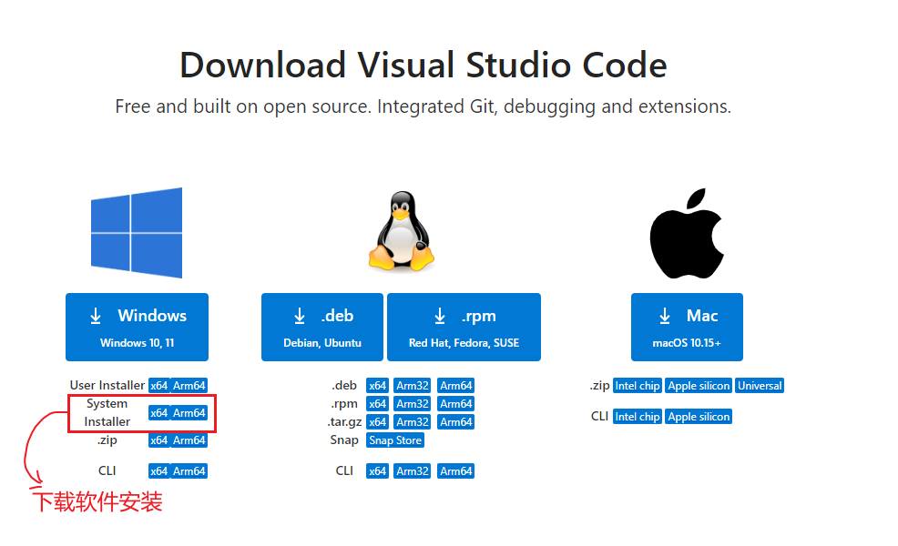
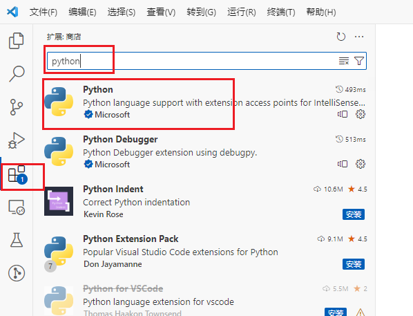
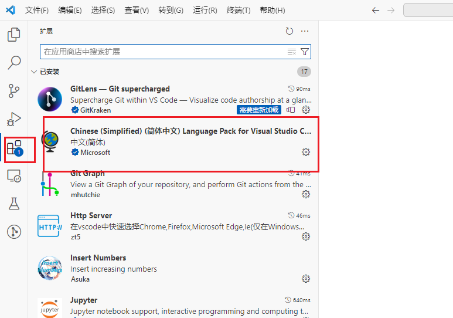
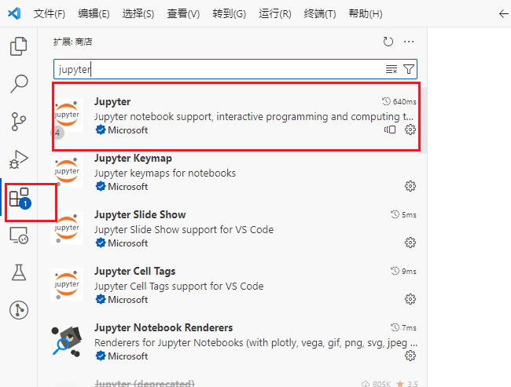
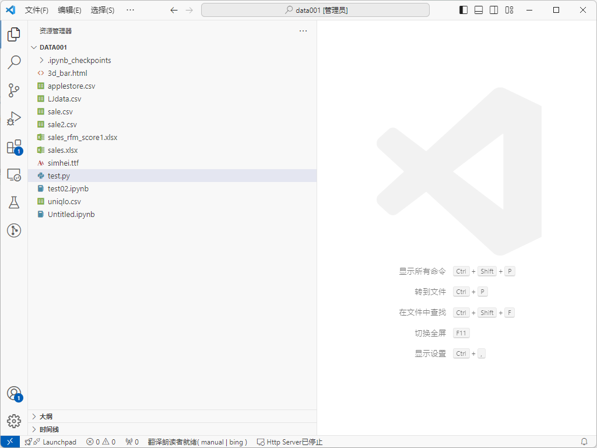
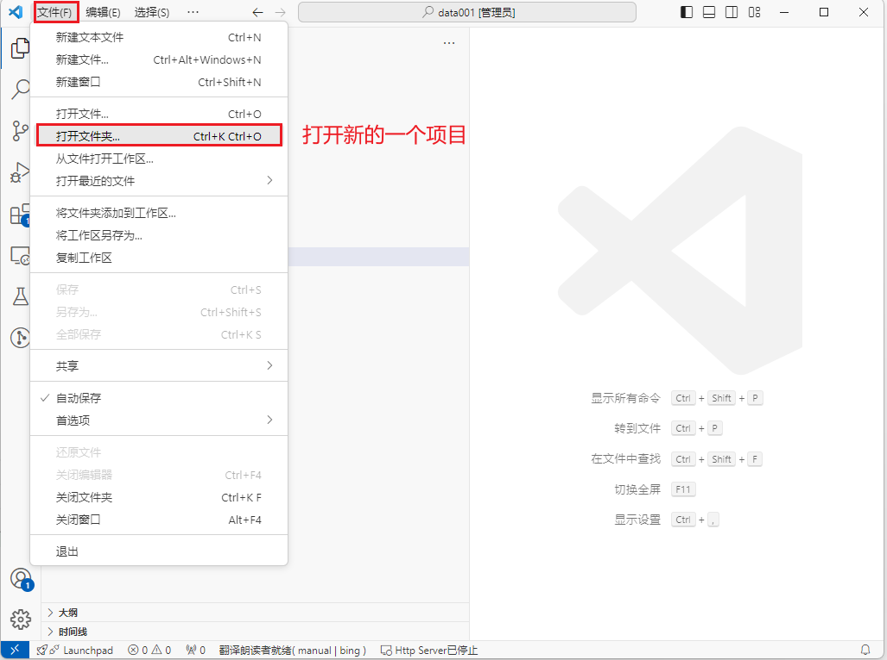
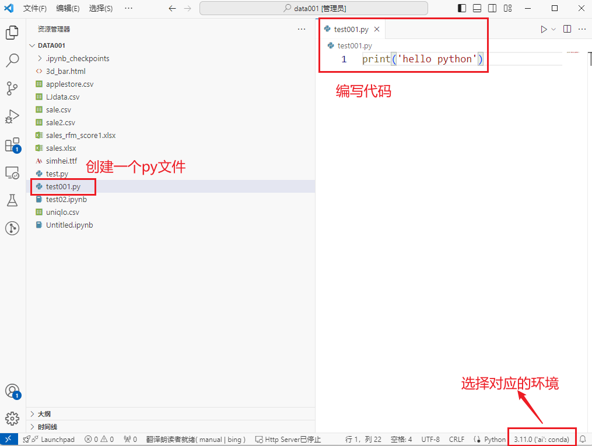

# 软件下载

下载地址: https://code.visualstudio.com/Download

> 

# 软件安装

`软件安装路径建议不用放到中文或者空格目录`

```properties
# 1 直接通过exe的软件安装
# 直接通过下一步安装即可
```

```properties
# 2 打开vscode, 安装一些必要的插件
# python插件
# 中文简体插件
# jupyter 插件()  
# 
# pip install jupyterlab 需要再使用的环境中安装该依赖
```

> 
>
> 
>
> 

# 软件使用

在本地文件夹创建空目录(项目的目录)

打开vscode(以管理员权限打开)

> 

打开新的项目

> 

> 

> 