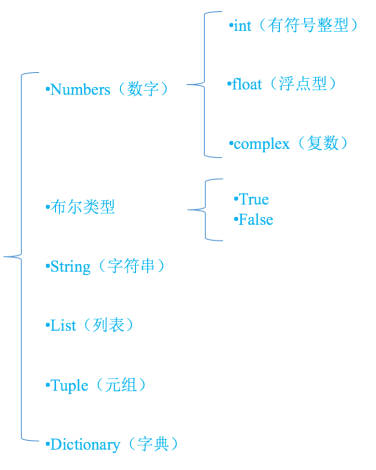

# 一、Python 介绍

Python（英国发音：/ˈpaɪθən/；美国发音：/ˈpaɪθɑːn/），是一种广泛使用的解释型、高级和通用的编程语言。Python 支持多种编程范型，包括结构化、过程式、反射式、面向对象和函数式编程。它拥有动态类型系统和垃圾回收功能，能够自动管理内存使用，并且其本身拥有一个巨大而广泛的标准库。它的语言结构以及面向对象的方法，旨在帮助程序员为小型的和大型的项目编写逻辑清晰的代码。


吉多·范罗苏姆（Guido van Rossum）是一名荷兰计算机程序员，他作为 Python 程序设计语言的作者而为人们熟知。他于 1980 年代后期开始研发 Python。吉多·范罗苏姆于 1991 年首次发布 Python 0.9.0。Python 2.0 于  2000 年发布并引入了新功能。Python 3.0 于 2008 年发布，它是该语言的主要修订版，**并非完全向后兼容**。Python 2 于 2020 年随 2.7.18 版停止支持。


那这么多种编程语言，为什么选择 Python？`人生苦短, 我用 Python`。Python 的设计哲学，强调代码的可读性和简洁的语法，尤其是使用空格缩进来划分代码块。相比于 C 或 Java，Python 让开发者能够用更少的代码表达自己想法。

最新的[编程语言排名](https://www.tiobe.com/tiobe-index)如下：


Python 的应用场景如下：

- 科学计算
- 数据分析
- Web 开发
- 人工智能
- 自动化运维
- 爬虫技术
- 自动化测试

# 二、环境安装

## 1、Anaconda

[Anaconda](https://www.anaconda.com) 是一个流行的 Python 数据科学和机器学习平台，用于管理和部署数据科学项目。它提供了一个开发环境，其中包含了众多常用的数据科学工具和库，如 Python 编程语言、NumPy、Pandas、SciPy、Matplotlib、Scikit-learn 等。

Anaconda 的主要作用是简化数据科学项目的设置和管理。它通过提供一个集成的发行版，使用户能够轻松地安装、配置和升级数据科学工具。Anaconda 还包含了一个名为 conda 的包管理器，它能够帮助用户创建独立的 Python环境，以便**在不同项目之间隔离不同的依赖关系**。

以下是 Anaconda 的一些主要功能和作用：

- 包管理：Anaconda 提供了 conda 包管理器，可以方便地安装、升级和删除各种数据科学工具和库，而无需手动处理依赖关系。
- 环境管理：conda 还可以**创建和管理独立的 Python 环境**。这意味着你可以在同一台计算机上同时拥有多个项目，每个项目都有自己独立的 Python 环境和依赖项，避免了版本冲突和包管理的困扰。
- 数据科学工具和库：Anaconda 预先包含了许多常用的数据科学工具和库，使用户可以立即开始进行数据分析、数据可视化和机器学习等任务，而无需手动安装它们。
- 跨平台支持：Anaconda 可以在多个操作系统上运行，包括 Windows、macOS 和 Linux。

总之，Anaconda 是一个强大的数据科学平台，它简化了数据科学项目的设置和管理，提供了丰富的数据科学工具和库，以及便捷的包管理和环境管理功能，使数据科学家和机器学习工程师能够更加高效地进行工作。


在课堂资料中找到 `Anaconda3-2023.07-0-Windows-x86_64.exe` 点击安装如下步骤安装即可，环境变量（anaconda安装目录\condabin）配置好就可以使用如下常用命令：  

```shell
# 创建新的环境
conda create --name 环境名称
# 创建指定 Python 版本的环境
conda create --name 环境名称 python=版本号
# 查看环境 
conda env list 
# 激活环境
conda activate 环境名称
# 删除环境
conda remove -n 环境名称 --all

# 安装指定包：
conda install 包名称
# 安装指定版本的包
conda install 包名称=版本号
# 安装多个包
conda install 包名称1 包名称2 包名称3
# 查看当前环境的所有包
conda list
# 卸载包
conda remove 包名称
```

> 配置镜像，把课堂资料中的 Anaconda文件夹下 .condarc 和 文件夹 pip 放到电脑磁盘 `C:\Users\你的电脑名字` 这个目录下即可。

## 2、pip

pip 是一个现代的，通用的 Python 包管理工具。提供了对 Python 包的查找、下载、安装、卸载的功能。注：pip 已内置于 Python 3.4 和 2.7 及以上版本，其他版本需另行安装。常见命令如下：

```shell
# 安装库
pip install package-name

# 查看已安装的库
pip list

# 卸载库
pip uninstall package_name

# 导出环境依赖库到 requirements.txt 文件中
pip list --format=freeze > ./requirements.txt
# 从 requirements.txt 文件给环境安装依赖库
pip install -r requirements.txt
```

## 3、Visual Studio Code

[Visual Studio Code](https://code.visualstudio.com)（简称 VS Code）是一个免费开源的跨平台代码编辑器，由微软开发和维护。它被广泛用于软件开发和编程，支持多种编程语言，并提供丰富的功能和插件生态系统。

以下是 Visual Studio Code 的一些主要特点和功能：

- 跨平台支持：Visual Studio Code 可以在 Windows、macOS 和 Linux 等多个操作系统上运行，确保开发者能够在自己喜欢的平台上使用它。
- 轻量级编辑器：VS Code 采用轻量级的设计理念，启动速度快，占用系统资源少，使得开发者能够高效地编辑和处理代码。
- 语法高亮和智能感知：VS Code 提供了丰富的语法高亮功能，可以根据不同的编程语言突出显示关键字、变量和注释。同时，它还提供了智能感知和自动完成功能，帮助开发者更快地编写代码。
- 内置调试功能：VS Code 内置了强大的调试功能，可以方便地进行代码调试和故障排查。开发者可以设置断点、观察变量值，并逐步执行代码，以便更好地理解程序的运行过程。
- 版本控制集成：VS Code 集成了流行的版本控制系统（如Git），使开发者能够直接在编辑器中进行代码版本管理、提交和拉取操作，无需切换到其他工具。
- 插件生态系统：VS Code 提供了广泛的插件生态系统，可以通过安装扩展来增加编辑器的功能。开发者可以根据自己的需求安装各种插件，如语言支持、代码片段、主题等。
- 自定义性：VS Code 允许用户根据自己的喜好进行界面和主题的个性化定制，使编辑器更符合个人偏好和风格。

总之，Visual Studio Code 是一个功能强大、轻量级且高度可定制的代码编辑器，适用于各种编程语言和开发环境。它的跨平台支持、丰富的功能和插件生态系统使得开发者能够高效地编写、调试和管理代码。

> 记得给 VS Code 安装 Python 插件。

# 三、基础语法

## 1、注释

注释不用用来执行的代码，是用来对代码的功能，作用等进行补充说明，用来帮助开发人员理解程序的辅助说明文字。

单行注释，使用 # 号开头， 后面紧接一个空格。

```python
# 程序是从上往下的顺序执行
print('hello') # 打印字符串 hello
print('python') # 打印字符串 python
print(123) # 打印数值 123
```

多行注释，使用三个单引号或者三个双引号。

```python
'''
python 的解析器是 python.exe 程序
运行程序的命令是：python hello.py
在程序中使用注释，可以让程序更加清晰，方便别人理解
'''
print('hello')
print(123)
```

## 2、标识符和关键字

标识符就是程序员在程序中自定义的变量名 、函数名、类名。名字就需要起到见名知意的效果。标识符命名规则

- 见名知意
- 由字母，下划线和数字组成
- 不能以数字开头
- 不能是其他特殊符号
- 不能和关键字重名

关键字就是程序发明者规定的有特殊含义的单词。运行如下代码可以查看 Python 中有哪些关键字：

```python
import keyword  # 导入模块 keyword
print(keyword.kwlist)  # 打印关键字列表
```

 标识符命名规则

- 小驼峰式命名法：第一个单词首字母小写，以后单词的首字母大写。例如：myName、fileNotFoundError。

- 大驼峰式命名法：每一个单字的首字母均大写。例如：FirstName、FileNotFoundError。

- 蛇形命名法：使用小写字母和下划线（_）将单词连接起来。例如：process_data、add_num。

> 一般情况下：
>
> 1、对于类名使用大驼峰命名
>
> 2、对于一般的变量名和函数名，使用蛇形命名(根据 PEP8 风格指南)

## 3、变量和数据类型

变量用于存储某个或某些特定的值，它与一个特定标识符相关联，该标识符称为变量名称。

```python
# 声明一个名为 str 的变量，并通过 = 符号存储字符串 hello
str = 'hello'
```

常见数据类型如下图：



### 3.1、数字类型(number)

在 Python 中，可以使用 `int`、`float` 和 `complex` 三个类型变量来分别表示整数、浮点数和复数（复数由实数部分和虚数部分组成，虚数部分以字母 "j" 或 "J" 结尾。）。例如：

```python
a = 10      # int 变量
b = 3.14    # float 变量
c = 2+3j    # complex 变量

print(0.1 + 0.1 + 0.1)  # 浮点数会丢失精度
print(5 / 3)  # 会有小数部分
print(5 // 3) # 整除操作
```

数字类型常见运算如下：

| 操作            | 结果                               |
| --------------- | ---------------------------------- |
| x + y           | x 加 y 的结果                      |
| x - y           | x 减 y 的结果                      |
| x * y           | x 乘以 y 的结果                    |
| x / y           | x 除以 y 的结果                    |
| x // y          | x 除以 y 的结果，向下取整          |
| x % y           | x 除以 y 的余数                    |
| -x              | x 的相反数                         |
| +x              | x 本身                             |
| abs(x)          | x 的绝对值                         |
| int(x)          | 将 x 转换成整数                    |
| float(x)        | 将 x 转换成浮点数                  |
| complex(re, im) | 返回一个复数，re 是实部，im 是虚部 |
| c.conjugate()   | 返回 c 的共轭复数                  |
| divmod(x, y)    | 返回（x // y, x % y）              |
| pow(x, y)       | 计算 x 的 y 次方                   |
| x ** y          | 计算 x 的 y 次方                   |

### 3.2、布尔类型(bool)

布尔型只有两个取值：True 和 False。它用于表示真和假、是和不是、有和没有等对立的概念。例如：

```Python
x = True   # 表示为真
y = False  # 表示为假
```

| 运算符 | 含义                                                     |
| ------ | -------------------------------------------------------- |
| and    | 左边和右边同时为 True，结果为才为 True，其他情况为 False |
| or     | 左边或者右边其中一个为 True，其他情况为 False            |
| not    | 取反操作，not True 结果为 False，not False 结果为 True   |

### 3.3、字符串(string)

Python 中的字符串是一系列字符序列，被包含在两个引号（单引号或双引号）之间。

例如：

```Python
my_string = 'Hello, world!'
```

在 Python 中，字符串是不可变的，这意味着一旦一个字符串被创建，就不能再修改它的字符。但是，可以使用字符串的拼接、格式化和替换等方法来创建新的字符串。

例如，可以使用加号 `+` 运算符来连接两个字符串：

```Python
first_name = 'Alice'
last_name = 'Smith'
full_name = first_name + ' ' + last_name
print(full_name)  # 输出：'Alice Smith'
```

可以使用字符串的 format() 方法来格式化字符串，例如：

```Python
name = 'Alice'
greeting = 'Hello, {}!'".format(name)
print(greeting)  # 输出：'Hello, Alice!'
```

还可以使用字符串的 replace() 方法来替换字符串中的子字符串，例如：

```Python
text = 'The quick brown fox jumps over the lazy dog.'
new_text = text.replace('fox', 'cat')
print(new_text)  # 输出：'The quick brown cat jumps over the lazy dog.'
```

需要注意的是，在 Python 中，字符串和数字等数据类型是不同的，因此不能将它们直接相加或连接。如果要将字符串转换为数字，可以使用 int()、float() 等内置函数。如果要将数字转换为字符串，可以使用 str() 函数。

### 3.4、列表(list)

Python 中的列表（list）是一种**可变**序列类型，可以用来存储一组**有序**的数据。列表中的元素可以是任何类型，包括数字、字符串、布尔值、列表等。以下是 Python 中列表的一些基本操作：

创建列表： 

```Python
my_list = [1, 2, 3, "four", "five"]

# 除此之外，我们还可以用 Python 中的列表推导生成列表
# 列表推导是一种简洁的语法，用于从可迭代对象中创建一个新的列表。
my_list2 = [i * 2 for i in range(10)]

# 只留下奇数
my_list3 = [i + 1 for i in range(10) if i % 2 == 0]

# 不过别把推导表达式写得过于复杂了，因为我们要遵循 KISS 原则，就是 Keep It Simple & Stupid
```

访问列表中的元素：

```Python
my_list[0]  # 访问第一个元素，输出 1
my_list[2]  # 访问第三个元素，输出 "three"
```

修改列表中的元素：

```Python
my_list[1] = "two"
my_list.append("six")
```

删除列表中的元素：

```Python
del my_list[3]  # 删除第三个元素
my_list.remove("four")  # 删除第一个出现的"four"元素
```

列表切片：

```Python
my_list[1:3]  # 访问第二个到第三个元素，输出 [2, 3]
my_list[:3]   # 访问第一个到第三个元素，输出 [1, 2, 3]
my_list[3:]   # 访问第四个元素到最后一个元素，输出 ["four", "five", "six"]
```

列表长度和判断是否为空：

```Python
len(my_list)  # 输出列表的长度，输出 5
my_list == []  # 如果列表为空，输出 False，否则 True
```

这些是一些常用的列表操作。还有很多其他的操作可以使用，比如使用列表作为函数参数、返回值，以及使用内置函数对列表进行排序、查找最大值和最小值等操作。

### 3.5、元组(tuple)

Python 中的元组（tuple）是一种**不可变**序列类型，类似于列表（list），但与列表不同的是，元组一旦创建就不能修改。以下是创建元组的两种方式：

使用圆括号将元素括起来，用逗号分隔：

```Python
my_tuple = (1, 2, 3, "hello")
```

使用元组字面量（tuple literal）表示法，在元素后面加上一个逗号：

```Python
my_tuple = 1, 2, 3, "hello"
```

和列表一样，元组也可以通过索引访问其元素：

```Python
print(my_tuple[0])   # 输出 1
print(my_tuple[3])   # 输出 "hello"
```

元组也可以用加号运算符进行拼接：

```Python
my_tuple = (1, 2, 3) + ("hello", "world")
print(my_tuple)   # 输出 (1, 2, 3, "hello", "world")
```

元组还可以用内置函数 tuple() 将其他可迭代对象转换为元组：

```Python
my_list = [1, 2, 3, "hello"]
my_tuple = tuple(my_list)
print(my_tuple)   # 输出 (1, 2, 3, "hello")
```

### 3.6、字典(dict)

Python 字典是 Python 中的一种内置数据类型，用于存储具有映射关系的数据。Python 字典以键值对的形式存储数据，其中键和值可以是任何不可变数据类型，如整数、浮点数、字符串等。字典中的键必须是唯一的，而值可以重复。Python 字典的创建可以使用花括号语法或 dict() 函数，例如：

```Python
# 使用花括号语法创建字典
my_dict = {'apple': 1, 'banana': 2, 'orange': 3}
# 使用 dict() 函数创建字典
my_dict = dict(apple=1, banana=2, orange=3)

# 访问字典中的值
print(my_dict['apple']) # 1

# 使用 get() 方法避免键不存在时的异常
print(my_dict.get('apple')) # 1
print(my_dict.get('icecream')) # 返回 None

# 添加、修改和删除键值对
my_dict['apple'] = 10
my_dict['banana'] = 20
del my_dict['orange']
```

Python 字典的常用方法有 pop()、keys()、values() 等，有兴趣的同学可以试下。

> 运算符优先级（了解）

| 优先级 | 运算符                              |
| ------ | ----------------------------------- |
| 1      | 括号 ()                             |
| 2      | 幂运算 **                           |
| 3      | 一元运算符 +x，-x                   |
| 4      | 乘法、除法和取模运算 * / // %       |
| 5      | 加法和减法运算 + -                  |
| 6      | 位运算 << >> & \| ^ ~               |
| 7      | 比较运算 < <= > >= == !=            |
| 8      | 逻辑运算符 not and or               |
| 9      | 赋值运算符 = += -= *= /= //= %= **= |

## 4、分支语句

分支语句是编程中的一种控制结构，用于根据条件的不同执行不同的代码块。它允许程序根据条件的真假选择性地执行特定的代码，以实现不同的逻辑分支。

Python 中的分支语句使用关键字 `if`、`elif`（可选）和 `else`（可选）。

```python
# 输入一个数，并且打印它是负数、0、还是正数，并输出它的绝对值

# 获取用户输入的数值
num = int(input("请输入一个数值："))

# 使用 if-else 语句判断数值的正负性
if num > 0:
    print("这是一个正数")
elif num == 0:
    print("这是 0")
else:
    print("这是一个负数")
```

> Python 中有一个特殊的三元条件运算符 `expression1 if condition else expression2`，可以用于简单的条件判断。

```python
# 三元运算符
result = "大于等于 0" if num >= 0 else "小于 0"
print(result)
```

## 5、循环语句

在 Python 中，有几种不同的循环结构可供使用，每种结构都有其特定的用途和语法。以下是 Python 中可用的循环结构：

1. `for` 循环：用于遍历任何可迭代的对象，例如列表、元组、字典等。语法如下：

```Python
for variable in iterable:
    # 执行操作
```

2. `while` 循环：用于在条件为真时重复执行一组语句。语法如下：

```Python
while condition:
    # 执行操作
```

3. `for`...`in`...`range()` 循环：用于遍历一个指定范围内的数字。语法如下：

```Python
for i in range(start, stop, step):
    # 执行操作
```

其中，`start` 参数表示范围的起始值，`stop` 参数表示范围的结束值（不包括在范围内），`step` 参数表示步长。如果不指定步长，默认为 1。

4. `for`...`in` 循环：用于遍历一个对象的属性或键。语法如下：

```Python
for key in dict:
    # 执行操作
```

其中，`dict` 表示要遍历的字典对象，`key` 表示字典的键。

在使用循环结构时，请确保您已经明确知道要执行的步骤，以及循环的结束条件。否则，程序可能会进入无限循环，导致死循环。

```python
my_list = [1, 2, 3, "four", "five"]
# 遍历列表
for ele in my_list:
    print(ele)

my_dict = {'apple': 1, 'banana': 2, 'orange': 3}
# 遍历字典
for key in my_dict:
    print(key, my_dict[key])
```

`range` 是一个内置函数，用于创建一个表示数字序列的范围对象。`range` 函数常用于循环中控制迭代的次数，或者生成一系列连续的整数。

```python
range(stop)
range(start, stop, step)
```

其中：

- `start`：可选参数，表示范围的起始值，默认为 0。
- `stop`：必需参数，表示范围的结束值，但不包含该值。
- `step`：可选参数，表示范围值之间的步长，默认为 1。

```python
# 示例 1：在循环中使用 range
for i in range(5):
	print(i)               # 输出: 0 1 2 3 4
    
# 示例 2：使用 range 创建一个范围对象
numbers = range(5)         # 生成一个包含 0 到 4 的范围对象
print(list(numbers))       # 输出: [0, 1, 2, 3, 4]

# 示例 3：指定范围的起始值和结束值
numbers = range(1, 6)      # 生成一个包含 1 到 5 的范围对象
print(list(numbers))       # 输出: [1, 2, 3, 4, 5]

# 示例 4：指定范围的起始值、结束值和步长
numbers = range(1, 10, 2)  # 生成一个包含 1 到 9 的奇数范围对象
print(list(numbers))       # 输出: [1, 3, 5, 7, 9]

# 示例 5：倒序范围
numbers = range(10, 0, -1) # 生成一个包含 10 到 1 的范围对象，倒序
print(list(numbers))       # 输出: [10, 9, 8, 7, 6, 5, 4, 3, 2, 1]
```

`zip()` 可以用 for 循环并行迭代。

```python
list1 = [1, 2, 3]
list2 = [4, 5, 6]

for a, b in zip(list1, list2):
    print(a, b)
```

## 6、函数

Python 中，函数是一段可重复使用的代码块，用于执行特定的任务或解决特定的问题。函数可以接受输入参数，执行一系列操作，并返回结果。以下是一个简单的 Python 函数示例：

```python
def add_numbers(x, y):
    """
    This function adds two numbers and returns the result.
    """
    result = x + y
    return result
```

这个函数名为 `add_numbers`，它接受两个输入参数 x 和 y，将它们相加并返回结果。

函数的定义由关键字 def 和函数名称开始，后面跟着括号，括号中可以包含参数列表。冒号后面缩进的代码块是函数的主体，它包含要执行的代码。

这个函数使用文档字符串来描述它的目的。文档字符串是放在函数定义前面的三重引号字符串，用来描述函数的作用、参数、返回值等信息。在上面的示例中，文档字符串描述了函数将两个数字相加并返回结果。

可以在需要使用该函数的地方调用它。例如：

```Python
result = add_numbers(3, 5)
print(result) # 输出: 8
```

这里调用了 `add_numbers` 函数并将参数 3 和 5 传递给它。函数返回结果 8，将其赋值给变量 result，并使用 print 函数输出结果。

> Python 中的函数使用关键字 `def` 来定义，函数可以接受任意数量和类型的参数，包括位置参数、关键字参数和默认参数，函数可以使用 `return` 语句返回一个值或者多个值，也可以没有返回值（返回 `None`），其可以支持不定长参数来接受任意数量的参数。

```python
# 可变位置参数：使用单个星号 * 来定义可变位置参数
# 这样定义的参数会将传入的多个位置参数打包成一个元组
def my_function(*args):
    for arg in args:
        print(arg)
my_function(1, 2, 3)

# 可变关键字参数：使用双星号 ** 来定义可变关键字参数
# 这样定义的参数会将传入的多个关键字参数打包成一个字典
def my_function(**kwargs):
    for key, value in kwargs.items():
        print(key, value)
my_function(a=1, b=2, c=3)
```

## 7、文件操作

Python 中，永久存储指将数据存储在计算机中，并在程序重新启动时保留数据。这通常涉及使用文件、数据库或其他类似持久存储的机制，这里讲文件操作。

使用 Python 内置的文件操作函数，如 `open()` 和 `close()`，可以将数据写入文件并在需要时读取它们。可以使用不同的模式（如写模式、追加模式等）来控制数据的写入和读取方式。

在 Python 中，根据操作文件的模式和文件的类型, 有不同的文件操作处理方式，处理方式如下：

> 1. r 以只读方式打开文件。文件的指针将会放在文件的开头。这是默认模式。
> 2. w 打开一个文件只用于写入。如果该文件已存在则将其覆盖。如果该文件不存在，创建新文件。
> 3. a 打开一个文件用于追加。如果该文件已存在，文件指针将会放在文件的结尾。也就是说，新的内容将会被写入到已有内容之后。如果该文件不存在，创建新文件进行写入。
> 4. rb 以二进制格式打开一个文件用于只读。文件指针将会放在文件的开头。这是默认模式。
> 5. wb 以二进制格式打开一个文件只用于写入。如果该文件已存在则将其覆盖。如果该文件不存在，创建新文件。
> 6. ab 以二进制格式打开一个文件用于追加。如果该文件已存在，文件指针将会放在文件的结尾。也就是说，新的内容将会被写入到已有内容之后。如果该文件不存在，创建新文件进行写入。
> 7. r+ 打开一个文件用于读写。文件指针将会放在文件的开头。
> 8. w+ 打开一个文件用于读写。如果该文件已存在则将其覆盖。如果该文件不存在，创建新文件。
> 9. a+ 打开一个文件用于读写。如果该文件已存在，文件指针将会放在文件的结尾。文件打开时会是追加模式。如果该文件不存在，创建新文件用于读写。
> 10. rb+ 以二进制格式打开一个文件用于读写。文件指针将会放在文件的开头。
> 11. wb+    以二进制格式打开一个文件用于读写。如果该文件已存在则将其覆盖。如果该文件不存在，创建新文件。
> 12. ab+    以二进制格式打开一个文件用于追加。如果该文件已存在，文件指针将会放在文件的结尾。如果该文件不存在，创建新文件用于读写。

下面是 Python 中读写文件的常用方法：

```Python
# 读取文件例子
file = open('file.txt', 'r')  # 打开文件
content = file.read()         # 读取文件内容
print(content)                # 输出文件内容
file.close()                  # 关闭文件
```

```Python
# 写入文件例子：
file = open('file.txt', 'w')  # 打开文件
file.write('Hello, world!')   # 写入文件内容
file.close()                  # 关闭文件
```

`with` 上下文管理器是一种在 Python 中处理文件的常用方式。它提供了一种简洁、安全地打开和关闭文件的方法，并自动处理异常和资源释放。

使用 `with` 上下文，可以在代码块中执行文件操作，并在操作完成后自动关闭文件。这样可以确保文件对象被正确关闭，即使在遇到异常时也能进行处理。

```python
with open('file.txt', 'r') as file:
    content = file.read()
    # 执行文件操作

# 在这里，文件已经被自动关闭
```

使用 `with` 上下文的好处包括：

- 自动资源管理：无需手动调用 `file.close()` 来关闭文件，`with` 上下文会在退出代码块时自动关闭文件。

- 异常处理：如果在文件操作过程中发生异常，`with` 上下文会正确处理异常，并确保文件被关闭，以避免资源泄漏。

- 代码简洁性：使用 `with` 上下文可以使代码更加简洁和可读，不需要显式处理文件的打开和关闭。

请注意，在使用 `with` 上下文管理器时，需要确保打开文件的模式和操作符合预期，并遵守文件的读写权限。此外，还应该注意在 `with` 代码块内执行的文件操作，以确保文件被正确处理和关闭。

## 8、异常处理

Python 中，异常是在程序运行时出现的错误或问题的标志。这些异常会导致程序停止执行，除非处理它们的代码被编写并且被调用。因此，在编写 Python 代码时，异常处理非常重要。

Python 中的异常处理通过 `try` 和 `except` 语句来实现。`try` 语句用于包含可能引发异常的代码块，而 `except` 语句用于包含处理异常的代码块。以下是一个简单的异常处理示例：

```Python
try:
    # 可能会引发异常的代码块
    x = int(input("请输入一个整数: "))
    result = 100 / x
    print("结果为:", result)
except ValueError:
    # 处理输入不是整数的情况
    print("输入必须是整数")
except ZeroDivisionError:
    # 处理除以0的情况
    print("不能除以 0")
except Exception as e:
    # 处理其他异常情况
    print("出现异常:", e)
finally:
    # 无论是否有异常都会执行的代码块
    print("程序执行完毕")
```

在上面的代码中，`try` 语句块中的代码尝试将用户输入的字符串转换为整数，并计算 100 除以输入值的结果。如果这个过程出现任何异常，程序将跳转到 `except` 语句块中的一个异常处理程序。如果 `try` 语句块中的代码没有引发任何异常，那么程序将跳过所有的 `except` 语句块，执行最后的 `finally` 语句块中的代码。

在 Python 中，还有其他的处理异常的方式和方法，例如使用 `raise` 语句可以抛出新的异常，使用 `try...else` 语句可以在没有异常发生时执行代码块等等。在编写 Python 代码时，一定要考虑到异常处理的重要性，并使用适当的异常处理技术来确保程序的健壮性和可靠性。

## 9、面向对象

面向对象是相对于面向过程来讲的，面向对象方法，把相关的数据和方法组织为一个整体来看待，从更高的层次来进行系统建模，更贴近事物的自然运行模式。

```python
class Person:
    def __init__(self, name, age):
        self.name = name
        self.age = age

    # 对象方法
    def say(self):
        print(f"大家好, 我是:{self.name}, 今年:{self.age}岁")
    
    # 类方法
    @classmethod
    def test(cls):
        print(f"这是一个类方法")

    # 字符串的方法
    def __str__(self):
        return f"我是:{self.name}, 今年:{self.age}岁"

# 创建一个对象
p = Person("admin", 18)
# 访问对象属性
print(p.name)
print(p.age)
# 修改对象属性值
p.age=100
# 打印对象
print(p)
```

内部类，类的一种定义方式，直白理解就是在类中嵌套声明类。

```python
# 车
class Car:
    def __init__(self):
        print('car')
        # 初始化电机
        self.motor = self.Motor()

    # 电机
    class Motor:
        def __init__(self):
            print('servo')
        def forward(self):
            print('前进')
            
car = Car()
car.motor.forward()
```

## 10、包和模块

Python 中的模块和包是 Python 代码组织的基本单元，是 Python 程序的基础组成部分。

在 Python中，一个文件（以 `.py` 为后缀名的文件）就叫做一个模块，每一个模块在 Python 里都被看做是一个独立的文件。Python 中的模块可分为三类，分别是内置模块、第三方模块和自定义模块。内置模块是 Python 中自带的模块；第三方模块是由非官方制作发布的、供给大众使用的 Python 模块等等。

包（Package）是包含模块文件的目录，目录名称就是包名称，目录中可以包含目录，子目录也是包，但包名称应该包含上一级目录的名称。Python 引入了按目录来组织模块是为了避免模块名冲突，不同包中的模块名可以相同。

模块和包的导入可以通过 `import` 语句实现。`import` 语句允许你使用 Python 代码来访问其他 Python 模块中的函数、类和变量等。

导入模块的基本语法如下：

```Python
import module_name
```

上述语法将 `module_name` 模块导入当前命名空间，可以在代码中使用 `module_name.function_name` 或 `module_name.class_name` 等方式来访问该模块中的函数、类等。

如果要使用模块中的短名称（即不包含模块名的名称）来访问模块中的内容，可以使用以下语法：

```Python
from module_name import function_name, class_name, ...
```

上述语法将 `function_name`、`class_name` 等导入当前命名空间，可以直接使用这些短名称来访问它们。

如果想要一次性导入一个模块中的所有内容，可以使用以下语法：

```Python
from module_name import *
```

上述语法将模块中的所有内容导入当前命名空间，可以直接使用这些内容。但是，不建议过多使用这种方式导入，因为这会导致命名空间污染。

下面演示使用*内置模块*：

```python
# 导入数学模块
import math

# 调用方式: 模块名.函数名
print(math.pi)
print(math.sqrt(4)) # 平方根函数
print(math.e)

# 导入随机数模块
from random import randint, shuffle
print(randint(1,10))
data = [1,2,3,4,5]
shuffle(data)
print(data)
```


下面演示导入*自定义模块*：

在同一个目录下，分别新建 `a.py` 和 `b.py` 文件，两个文件代码如下：

```python
# a.py

def aa():
    print('a.aa')
```

```python
# b.py

import a

a.aa()
```

若把 `a.py` 丢到当前目录下 `test` 子目录下，那么就要修改 `b.py` 文件中的代码，如下：

```python
# b.py

import test.a as a

a.aa()
```

> 但注意要在 test 目录中新建 `__init__.py`，作用是将文件夹变为一个 Python 模块。通常  `__init__.py` 文件为空，但是我们还可以为它增加其他的功能。


下面演示使用*第三方模块*：

先使用 pip 命令安装 NumPy，命令如下：

```shell
pip install numpy
```

下载成后，然后编写如下代码运行即可。

```python
import numpy as np # 导入第三方模块，并起别名
 
v = np.array([9,7,5,3,1])
print(v)
```
