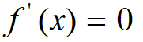
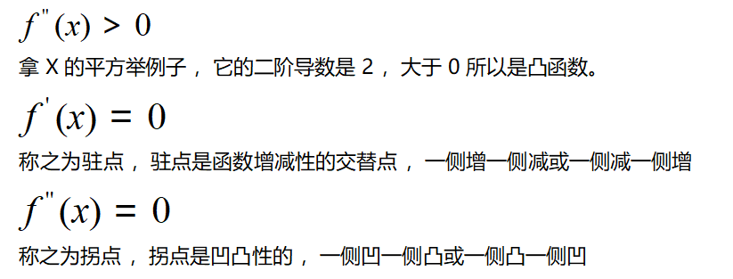

# 数学基础知识

推荐画图网站

https://www.symbolab.com

https://www.geogebra.org/calculator

https://www.desmos.com/calculator?lang=zh-CN

## 指数和对数

1. 指数（Exponentiation）：
   - 指数表示重复乘法的操作，用于表示多次相同因子的乘积。
   - 例如，$a^n$ 表示将 a 乘以自身 n 次，其中 a 是底数，n 是指数。
   - 指数有一些重要的性质，如指数运算律和指数函数的性质。
2. 对数（Logarithm）：
   - 对数是指数运算的逆运算，用于解决指数方程。
   - 对数函数的底数是正数且不等于 1，通常使用常用的对数（以 10 为底）或自然对数（以 e 为底）。
   - 对数函数的定义是 $y = log_b(x)$，其中 b 是底数，x 是真数，y 是对数值。
   - 对数函数具有一些重要的性质，如对数运算律和对数函数的性质。
3. 指数和对数的关系：
   - 指数和对数是互为逆运算的，即指数运算和对数运算可以互相取消。
   - 对数函数 $log_b(x)$ 的定义可以表述为 $b^y = x$。
   - 指数和对数之间的关系在解决指数方程、计算复利、衰减模型等问题中非常有用。
4. 指数和对数的应用：
   - 指数和对数在数学、科学、工程和经济学等领域中具有广泛的应用。
   - 指数和对数可以用于解决各种指数方程和对数方程，例如生长模型、复利计算、强度衰减等问题。
   - 指数和对数还在概率论、统计学、信号处理等领域中有重要的应用。

> 1. 指数函数：$y = a^x$，其中 a 是常数，x 是指数。
> 2. 自然指数函数：$y = e^x$，其中 e 是自然对数的底数。

> 1. 常用对数函数：y = log(x)，以10为底的对数函数。
> 2. 自然对数函数：y = ln(x)，以自然对数 e 为底的对数函数。

- $2^3=8$
- $4^{-1}=1/4$

- $4^{-2} =1/16$
- $log2^8  =3$
- $log4^{1/4}  = -1$
- $log4^{1/16} = -2$

## 标量和向量

在数学和物理学中，`标量`和`向量`是两个基本的数学概念，用于描述物理量和其相关性质。

1. 标量（Scalar）： 标量是只具有大小（大小、量值、数值）的物理量，没有方向。标量只需要一个实数或复数来表示。
   - 示例：时间、质量、温度、电荷等。这些物理量仅仅关注其大小，而不考虑方向。
2. 向量（Vector）： 向量是既有大小（模、长度）又有方向的物理量。向量需要在空间中的一定位置上有一个起点和一个终点，并且可以通过大小和方向来描述。
   - 示例：位移、速度、加速度、力等。这些物理量除了具有大小，还具有方向。

向量通常使用箭头来表示，箭头的长度表示向量的大小，箭头的方向表示向量的方向。向量可以在坐标系中用多个分量（如x、y、z）表示，也可以使用单位向量和标量乘积来表示。

值得注意的是，有时候在一维空间中，向量也可以被视为标量，因为它们只有一个分量，并且没有方向。

总结起来，标量只具有大小，没有方向，而向量具有大小和方向。在物理和数学问题中，准确区分标量和向量的概念对于正确建模和解决问题非常重要。

## 线性函数

线性函数是一类特殊的数学函数，其定义遵循线性关系的特性。线性函数的表达式可以写为：

$f(x) = a * x + b$

其中，a 和 b 是常数，x 是自变量，f(x) 是因变量。

线性函数的特点包括：

1. 线性关系：自变量 x 和因变量 f(x) 之间存在直接的线性关系。
2. 直线图像：线性函数的图像是一条直线，且斜率为 a，截距为 b。
3. 恒定斜率：线性函数的斜率 a 是恒定的，表示单位自变量的变化引起的因变量的变化。
4. 零截距：当 b = 0 时，线性函数经过原点，图像经过原点 (0, 0)。

线性函数在数学、物理、经济学等领域具有广泛的应用。例如，直线运动中的位移与时间的关系、经济学中的成本与产量的关系等都可以用线性函数进行建模和描述。

线性函数的性质使得它们在数学和应用领域中易于分析和求解。通过计算斜率和截距，可以获得关于函数图像的重要信息，如方向、倾斜程度和截距点等。

需要注意的是，除了一次项之外，线性函数不包括高次项或非线性项。如果函数中包含其他项，例如平方项或指数项，则不再是线性函数。

# 微积分

## 导数的定义

$$
f'(x) = \lim_{{h \to 0}} \frac{{f(x + h) - f(x)}}{h}
$$

导数 ：这是微积分里面最核心的概念 ，当函数的自变量h 趋近于 0 的时候 ，如果存在式子里面的值 ，那么函数可导

> 

极限limit认为是高等数学和初等数学的分界线

使用定义计算下面的导数

$f(x)=3x$，计算 f′(x)

$f(x)=3x^2$，计算 f′(x)

## 左导数与右导数、可导函数

趋近于 0 有两个方向 ，从左边趋向于 0 是左导数 ，反之是右导数

下面的绝对值函数的左导数和右导数不相同 ，一个-1 一个+1 ，0 位置不可导 

f(x)=|x|

> 

Relu 函数 

> 

## 导数的几何意义与物理意义

> 

> 

# 常见的求导公式

常数求导
$$
\frac{d}{dx}c = 0
$$


$$
\frac{d}{dx}(c) = 0
$$


幂函数导数
$$
\frac{d}{dx}(x^n) = nx^{n-1}
$$
指数函数求导
$$
\frac{d}{dx}(a^x) = a^x \ln(a)
$$

$$
\frac{d}{dx}(e^x) = e^x
$$

对数函数导数
$$
\frac{d}{dx}(\log_a(x)) = \frac{1}{x \ln(a)}
$$

$$
\frac{d}{dx}(\ln(x)) = \frac{1}{x}
$$

# 导数的运算公式

## 常数倍法则

$$
\frac{d}{dx}(c \cdot f(x)) = c \cdot \frac{d}{dx}(f(x))
$$

这个公式表示如果一个函数 f(x) 乘以常数 c，那么它的导数等于常数与原函数的导数的乘积。

## 和差法则

$$
\frac{d}{dx}(f(x) + g(x)) = \frac{d}{dx}(f(x)) + \frac{d}{dx}(g(x))
$$

$$
\frac{d}{dx}(f(x) - g(x)) = \frac{d}{dx}(f(x)) - \frac{d}{dx}(g(x))
$$

这些公式表示如果一个函数 f(x) 和另一个函数 g(x) 相加或相减，那么它们的导数等于各自的导数的和或差。

## 乘积法则

$$
\frac{d}{dx}(f(x) \cdot g(x)) = f(x) \cdot \frac{d}{dx}(g(x)) + g(x) \cdot \frac{d}{dx}(f(x))
$$

这个公式表示如果一个函数 f(x) 乘以另一个函数 g(x)，那么它们的导数等于第一个函数乘以第二个函数的导数再加上第二个函数乘以第一个函数的导数。


## 商法则

$$
\frac{d}{dx}\left(\frac{f(x)}{g(x)}\right) = \frac{g(x) \cdot \frac{d}{dx}(f(x)) - f(x) \cdot \frac{d}{dx}(g(x))}{(g(x))^2}
$$

这个公式表示如果一个函数 f(x) 除以另一个函数 g(x)，那么它们的导数等于分子的导数乘以分母减去分子乘以分母的导数，再除以分母的平方。

## 链式法则

链式法则是求解`复合函数`导数的重要法则。根据链式法则，如果一个函数y=f(g(x)) 是由两个函数 f(u) 和 g(x) 组成的复合函数，则它的导数可以通过以下公式计算：
$$
\frac{dy}{dx} = \frac{df}{du} \cdot \frac{du}{dx}
$$
链式法则在求解复合函数的导数时非常有用，可以帮助简化计算过程。它在微积分和相关领域中具有广泛的应用。

# 求导练习题

1. **基础多项式求导**
- 求导：$f(x) = 4x^5 - 2x^3 + x^2 - 7$
  
2. **指数函数求导**
- 求导：$g(x) = e^{2x}$
  
3. **对数函数求导**
- 求导：$h(x) = \ln(x^3 + 2)$
  
4. **复合函数链式法则**
- 求导：$p(x) = (2x^2 - 3x + 4)^3$
  
5. **乘积法则应用**
- 求导：$q(x) = (x^3 - x)(x^2 + 5)$
  
6. **商法则应用**
- 求导：$r(x) = \frac{x^4 - 3x}{x + 1}$
  
7. **复合函数链式法则**
- 求导：$s(x) = \ln((x^2 + 1)^2)$
  
8. **指数与对数函数结合**
- 求导：$t(x) = e^{\ln(x+1)}$
  
9. **复杂复合函数链式法则**
- 求导：$u(x) = ((3x + 1)^2 - 2)^3$
  
   
  


# 高阶导数

前面学的是一阶导数,对导数再次求导就是高阶导数,二阶和二阶以上的导数统称为高阶导数。

> 

# 使用Python的SymPy求导数

求导：$h(x) = \ln(x^3 + 2)$

```Python
# 1 安装SymPy库
pip install SymPy
# 2 导入 SymPy 库
import sympy as sp
# 3 定义符号变量 x
x = sp.symbols('x')
# 4 定义函数 h(x)
h = sp.log(x**3 + 2)
# 5  求导数
h_prime = sp.diff(h, x)
# 打印导数
print("The derivative of h(x) = ln(x^3 + 2) with respect to x is:")
print(h_prime)
```

# 导数与函数单调性的关系

> 
>
> 函数的导数大于 0 ，函数是单调增的。  函数的导数小于 0 ，函数是单调减的。

> 
>
> 上图函数的导数是 2X ，那么就是 x<0 的时候函数单调减 ，x>0 的时候函数单调增。

# 极值定理

> 1. `费马（Fermat）极值定理：` 如果函数在某点取得局部极大值或极小值，并且在该点处可导，那么该点的导数为0。换言之，所有可能的极值点都是导数为0的点，这些点也被称为临界点或者驻点。
> 2. `罗尔（Rolle）定理：` 如果函数在闭区间[a, b]上连续，在开区间(a, b)内可导，并且f(a) = f(b)，那么在(a, b)内至少存在一点c，使得f'(c) = 0。即在这样的函数中，至少存在一个点在该点的切线水平。

导数为我们寻找极值提供依据,对于可导函数而言,因为在极值位置必然有函数的导数等于0



极值处函数的导数等于 0 ，这是必要条件 ，但不是充分条件 ，因为极值处的导数必然等于 0 ， 但是导数等于 0 处不代表一定是极值。

> 

# 导数与函数凹凸性的关系

函数的二阶导数是和函数的凹凸性是有关系的,凹凸性怎么定义的 ？

先记住凸函数是向下凹的 ，

反正就是凹的 是否是凸函数可以通过二阶导数 ,如果二阶导数是大于 0 就是凸函数 

> 

拿 X 的三次方举例子 ，一阶导是 3X 的平方 ，二阶导是 6X ，这样当 X 小于 0 就是凹函数 ， X 大于 0 就是凸函数。

> 如果一个函数的二阶导数在定义域内处处大于或等于0，那么这个函数就是凸函数。
>
> 如果一个函数的二阶导数在定义域内处处小于或等于0，那么这个函数就是凹函数。

# 作业

## 作业1 求 Sigmoid 函数的导数

**Sigmoid 函数定义**：Sigmoid 函数是常用的逻辑函数，定义为：$\sigma(x) = \frac{1}{1 + e^{-x}} $

**任务**：

- 使用微积分的链式法则手动求出 Sigmoid 函数的导数。
- 使用 `SymPy` 验证你的结果。

## 求 tanh 函数的导数

**tanh 函数定义**：双曲正切函数，定义为：$\tanh(x) = \frac{e^x - e^{-x}}{e^x + e^{-x}}$

**任务**：

- 使用微积分的商法则手动求出 tanh 函数的导数。
- 使用 `SymPy` 验证你的结果。